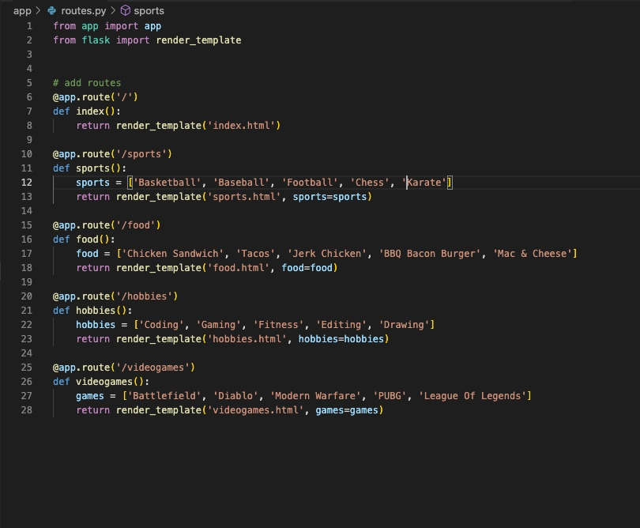

## Flask Routes :loop:

In this assignment I had to put into practice the skills I learned in Day 1's lecture lessions. I had to create a small web application in HTML with flask that had 2 or more routes that lead to a list of my 5 favorite things. I also sprinkled a little CSS in the application.

